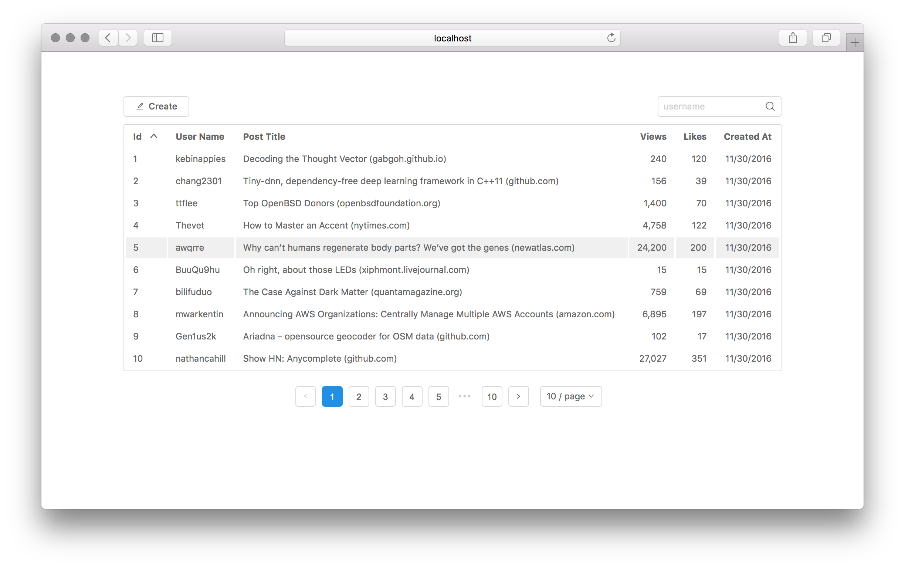

# Callstack Task



The solution to the [problem](https://gist.github.com/mnmtanish/478ca89c5c483b6df079d29aadc50221) given consists of 2 applications. The **server** is a mock data server which serves data using a GraphQL API. The **client** application is an example application which fetches data from the server.

## Features

 - Pagination and page size
 - Sorting by post fields
 - Filter posts by username
 - Creating new posts

## Getting Started

To check the solution, first start the server:

```
cd server
npm install
npm run start
```

And then start the client in another terminal window/tab/panel:

```
cd client
npm install
npm run start
```

The demo will be available in http://localhost:3000
